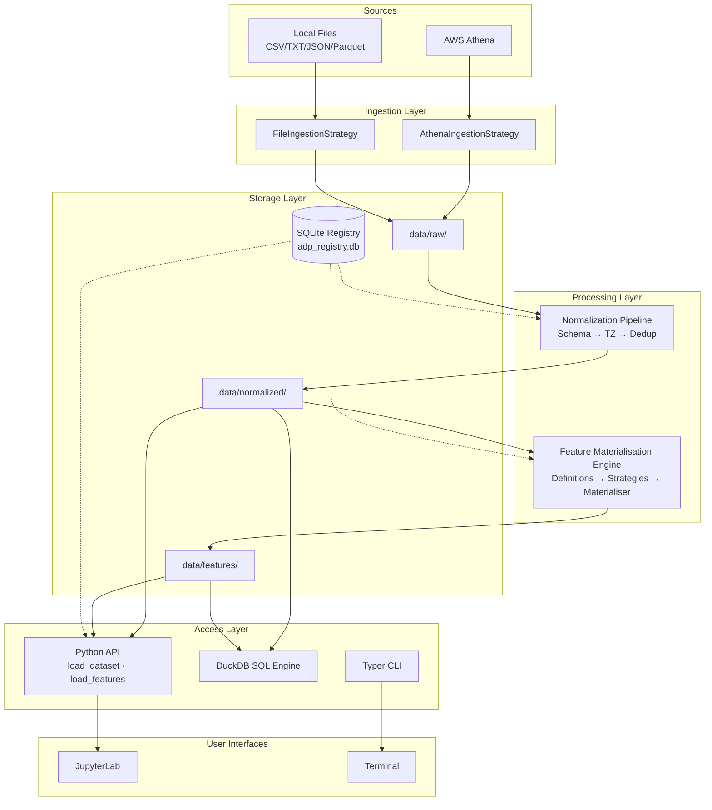
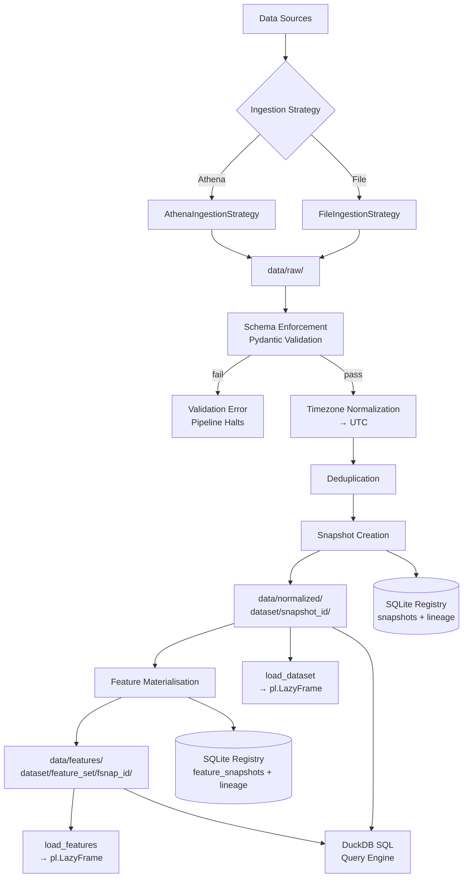
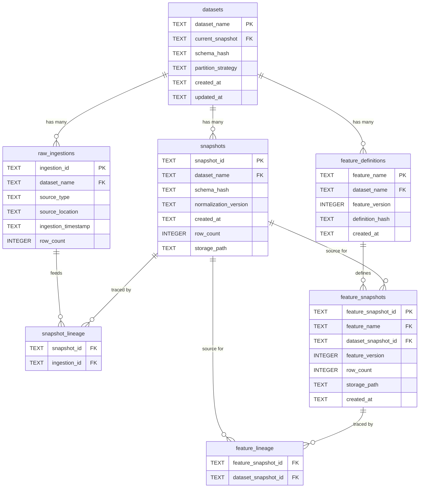
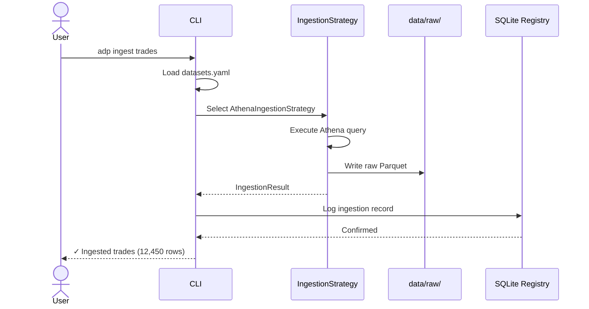
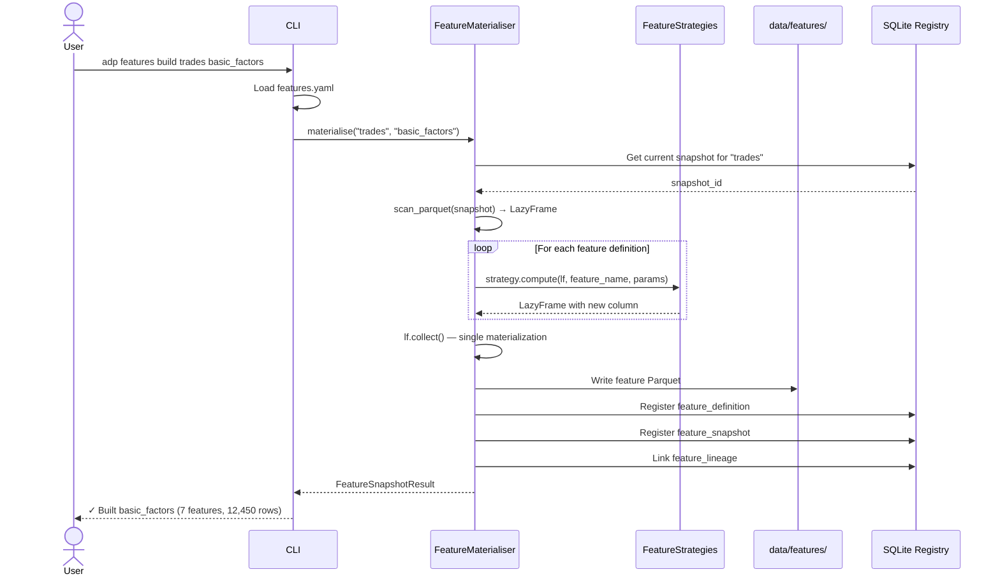

# Athena Data Platform (ADP) — Technical Design Document

> **Version**: 1.0
> **Date**: 2026-03-02
> **Status**: Draft
> **Owner**: Tech Lead
> **Audience**: Platform Engineering, Quant Research
> **Related**: [Project Delivery Plan](./01-project-delivery-plan.md) · [User Stories](./02-user-stories.md)

---

## Table of Contents

1. [Architecture Overview](#1-architecture-overview)
2. [Core Design Principles](#2-core-design-principles)
3. [Directory Structure](#3-directory-structure)
4. [Technology Stack & ADRs](#4-technology-stack--adrs)
5. [Data Flow](#5-data-flow)
6. [Component Design](#6-component-design)
7. [SQLite Database Schema](#7-sqlite-database-schema)
8. [Python Protocol Definitions](#8-python-protocol-definitions)
9. [API Contracts](#9-api-contracts)
10. [CLI Command Reference](#10-cli-command-reference)
11. [Configuration Schemas](#11-configuration-schemas)
12. [Sequence Diagrams](#12-sequence-diagrams)
13. [Error Handling Strategy](#13-error-handling-strategy)
14. [Change Log](#14-change-log)

---

## 1. Architecture Overview

ADP is a local lakehouse + research factor platform built for single-machine quantitative research. It combines immutable data storage, snapshot-based versioning, and deterministic feature materialisation into a unified Python platform.

### 1.1 High-Level Architecture (ASCII)

```
┌─────────────────────────────────────────────────────────────────────┐
│                        USER INTERFACES                              │
│  ┌──────────────┐  ┌──────────────┐  ┌────────────────────────┐    │
│  │  Typer CLI   │  │  Python API  │  │  JupyterLab Notebook   │    │
│  │  (adp ...)   │  │  (from adp)  │  │  (import adp)          │    │
│  └──────┬───────┘  └──────┬───────┘  └───────────┬────────────┘    │
└─────────┼─────────────────┼──────────────────────┼──────────────────┘
          │                 │                      │
          ▼                 ▼                      ▼
┌─────────────────────────────────────────────────────────────────────┐
│                        ACCESS LAYER                                 │
│  ┌────────────────────────────────────────────────────────────┐    │
│  │  api.py                                                     │    │
│  │  load_dataset() · load_features() · query_*() · list_*()   │    │
│  └──────────┬────────────────────────────┬─────────────────────┘    │
│             │                            │                          │
│  ┌──────────▼──────────┐    ┌────────────▼──────────────┐          │
│  │  Polars LazyFrame   │    │  DuckDB SQL Engine        │          │
│  │  (zero-copy read)   │    │  (SQL-over-Parquet)       │          │
│  └─────────────────────┘    └───────────────────────────┘          │
└─────────────────────────────────────────────────────────────────────┘
          │                            │
          ▼                            ▼
┌─────────────────────────────────────────────────────────────────────┐
│                        STORAGE LAYER                                │
│  ┌──────────────────────────────────────────────────────────────┐  │
│  │  data/                                                        │  │
│  │  ├── raw/           ← immutable source data                   │  │
│  │  ├── staged/        ← intermediate processing                 │  │
│  │  ├── normalized/    ← versioned dataset snapshots             │  │
│  │  └── features/      ← versioned feature snapshots             │  │
│  └──────────────────────────────────────────────────────────────┘  │
│  ┌──────────────────────────────────────────────────────────────┐  │
│  │  metadata/adp_registry.db  (SQLite WAL)                       │  │
│  │  datasets · ingestions · snapshots · lineage · features        │  │
│  └──────────────────────────────────────────────────────────────┘  │
└─────────────────────────────────────────────────────────────────────┘
          ▲                            ▲
          │                            │
┌─────────────────────────────────────────────────────────────────────┐
│                     PROCESSING LAYER                                │
│  ┌─────────────────────┐    ┌───────────────────────────────┐      │
│  │  Normalization       │    │  Feature Materialisation      │      │
│  │  Pipeline            │    │  Engine                       │      │
│  │  ┌─────────────────┐│    │  ┌───────────────────────────┐│      │
│  │  │ Schema Enforce  ││    │  │ Definition Parser         ││      │
│  │  │ TZ Normalize    ││    │  │ Strategy Registry         ││      │
│  │  │ Deduplicate     ││    │  │ Materialiser              ││      │
│  │  └─────────────────┘│    │  │ Feature Store             ││      │
│  └─────────────────────┘    │  └───────────────────────────┘│      │
│                              └───────────────────────────────┘      │
└─────────────────────────────────────────────────────────────────────┘
          ▲
          │
┌─────────────────────────────────────────────────────────────────────┐
│                      INGESTION LAYER                                │
│  ┌─────────────────────┐    ┌─────────────────────┐                │
│  │  AthenaIngestion    │    │  FileIngestion       │                │
│  │  Strategy           │    │  Strategy            │                │
│  │  (awswrangler)      │    │  (CSV/TXT/JSON/PQ)   │                │
│  └─────────────────────┘    └─────────────────────┘                │
└─────────────────────────────────────────────────────────────────────┘
          ▲                            ▲
          │                            │
    ┌─────┴─────┐              ┌───────┴───────┐
    │ AWS Athena│              │ Local Files   │
    └───────────┘              └───────────────┘
```

### 1.2 High-Level Architecture (Mermaid)



---

## 2. Core Design Principles

### 2.1 Immutability

All data artifacts are write-once. Raw files are never modified after ingestion. Normalized datasets exist as immutable snapshots identified by unique IDs. Feature outputs are versioned and stored alongside (never replacing) previous versions.

**Enforcement:**

- Storage paths include snapshot/version IDs, making overwrites structurally impossible
- No `UPDATE` or `DELETE` operations on data files
- Metadata records are append-only (only `current_snapshot` pointer is updated)

### 2.2 Reproducibility

Every output artifact can be reconstructed from its inputs and configuration:

```
Output = f(Input Data, Schema Version, Normalization Version, Feature Definition Version)
```

**Enforcement:**

- Schema hashes track column definitions
- Normalization version is stored per snapshot
- Feature definition hashes detect any change in computation logic
- Lineage tables record the complete dependency chain

### 2.3 Separation of Concerns

Each layer has a single responsibility and communicates through well-defined interfaces:

| Layer | Responsibility | Interface |
|-------|---------------|-----------|
| Ingestion | Extract data from sources | `IngestionStrategy` protocol |
| Processing | Validate, normalize, transform | `NormalizationPipeline`, `FeatureMaterialiser` |
| Storage | Write/read Parquet files | `StorageBackend` protocol |
| Metadata | Track lineage and versions | `MetadataRegistry` class |
| Access | User-facing data loading | `api.py` public functions |

### 2.4 Lazy Evaluation

All large data transformations use Polars LazyFrames. Collection (`.collect()`) is deferred to the latest possible moment — typically at the point of writing to Parquet or returning to the user.

**Rules:**

- `scan_parquet()` (lazy) is preferred over `read_parquet()` (eager)
- Feature strategies return `pl.LazyFrame`, not `pl.DataFrame`
- Only `api.py` callers decide when to `.collect()`

### 2.5 Data-as-Code

Datasets and features are described declaratively in YAML configuration files. Changes to these files are tracked the same way code changes are tracked — through version control and hashing.

---

## 3. Directory Structure

```
athena_data_platform/
│
├── config/
│   ├── datasets.yaml              # Dataset source and schema definitions
│   └── features.yaml              # Feature set definitions
│
├── data/
│   ├── raw/                       # Immutable raw ingested data
│   │   └── {dataset_name}/
│   │       └── {ingestion_id}.parquet
│   ├── staged/                    # Intermediate processing (optional)
│   ├── normalized/                # Immutable versioned snapshots
│   │   └── {dataset_name}/
│   │       └── {snapshot_id}/
│   │           ├── part-0.parquet
│   │           └── _metadata.json
│   └── features/                  # Immutable versioned feature snapshots
│       └── {dataset_name}/
│           └── {feature_set}/
│               └── {feature_snapshot_id}/
│                   ├── part-0.parquet
│                   └── _metadata.json
│
├── metadata/
│   └── adp_registry.db           # SQLite metadata registry (WAL mode)
│
├── src/adp/
│   ├── __init__.py                # Package init, re-exports public API
│   ├── api.py                     # Public Python API
│   ├── cli.py                     # Typer CLI entry point
│   ├── config.py                  # YAML config loader + Pydantic models
│   │
│   ├── ingestion/
│   │   ├── __init__.py
│   │   ├── protocol.py            # IngestionStrategy protocol
│   │   ├── athena.py              # AthenaIngestionStrategy
│   │   └── file.py                # FileIngestionStrategy
│   │
│   ├── processing/
│   │   ├── __init__.py
│   │   ├── schema.py              # Pydantic dynamic model factory
│   │   ├── normalizer.py          # Normalization pipeline
│   │   └── dedup.py               # Deduplication engine
│   │
│   ├── storage/
│   │   ├── __init__.py
│   │   ├── protocol.py            # StorageBackend protocol
│   │   ├── writer.py              # Parquet writer
│   │   ├── reader.py              # Parquet reader (lazy)
│   │   └── snapshot.py            # Snapshot creation engine
│   │
│   ├── metadata/
│   │   ├── __init__.py
│   │   ├── registry.py            # MetadataRegistry class
│   │   ├── models.py              # Metadata dataclasses
│   │   └── schema.py              # SQLite DDL and migration
│   │
│   └── features/
│       ├── __init__.py
│       ├── definitions.py         # Feature definition parser
│       ├── strategies.py          # Feature computation strategies
│       ├── materializer.py        # FeatureMaterialiser
│       ├── registry.py            # Feature metadata operations
│       └── feature_store.py       # Feature loading and discovery
│
├── tests/
│   ├── conftest.py                # Shared fixtures
│   ├── unit/
│   │   ├── test_config.py
│   │   ├── test_schema.py
│   │   ├── test_metadata.py
│   │   ├── test_ingestion.py
│   │   ├── test_normalizer.py
│   │   ├── test_features.py
│   │   └── test_snapshot.py
│   ├── integration/
│   │   ├── test_ingestion_pipeline.py
│   │   ├── test_snapshot_pipeline.py
│   │   ├── test_feature_pipeline.py
│   │   └── test_cli.py
│   └── e2e/
│       └── test_full_pipeline.py
│
├── notebooks/
│   └── research_demo.ipynb
│
├── pyproject.toml
└── README.md
```

---

## 4. Technology Stack & ADRs

### 4.1 Technology Matrix

| Component | Technology | Version | Purpose |
|-----------|-----------|---------|---------|
| DataFrame Engine | Polars | ~=1.38 (latest: 1.38.1) | Fast columnar processing with lazy execution |
| Analytical SQL | DuckDB | ~=1.4 (latest: 1.4.4) | SQL-over-Parquet, zero-copy reads |
| Metadata Store | SQLite | 3.x (stdlib) | Lightweight lineage and version tracking |
| File Format | Apache Parquet | — | Columnar storage, partition-friendly |
| Validation | Pydantic | ~=2.12 (latest: 2.12.5) | Runtime schema enforcement |
| CLI Framework | Typer | ~=0.24 (latest: 0.24.1) | Typed CLI with auto-generated help |
| AWS Data Access | awswrangler | ~=3.15 (latest: 3.15.1) | Athena query execution and result retrieval |
| Config Format | PyYAML | ~=6.0 | Human-readable dataset and feature definitions |
| Language | Python | >=3.11, <3.14 | Modern type hints, performance improvements |

### 4.2 ADR Summary

#### ADR-001: Polars over Pandas

**Context:** Need a DataFrame engine for large-scale columnar data processing.
**Decision:** Use Polars as the primary DataFrame engine.
**Rationale:** Native lazy execution prevents OOM on large datasets. Columnar memory layout is cache-friendly. Expression-based API is composable and deterministic. Significantly faster than Pandas for analytical workloads.
**Consequence:** Team must learn Polars expression syntax. Some ecosystem libraries may expect Pandas.

#### ADR-002: DuckDB for Ad-Hoc SQL

**Context:** Quant researchers prefer SQL for certain analytical queries.
**Decision:** Integrate DuckDB for SQL-over-Parquet.
**Rationale:** Embedded (no server), reads Parquet directly, excellent performance for analytical queries. Complements Polars for users who prefer SQL.
**Consequence:** Two query engines to maintain. Results must be convertible between DuckDB and Polars.

#### ADR-003: SQLite WAL for Metadata

**Context:** Need a persistent metadata store for lineage tracking.
**Decision:** Use SQLite in WAL mode.
**Rationale:** Embedded, zero-configuration, ACID-compliant. WAL mode allows concurrent reads during writes. Perfect for single-user local platform.
**Consequence:** Not suitable for multi-user or distributed access (acceptable per scope).

#### ADR-004: Parquet as Canonical Format

**Context:** Need a columnar file format for analytical storage.
**Decision:** Use Apache Parquet for all normalized and feature data.
**Rationale:** Industry standard for analytical workloads. Excellent compression. Native support in Polars and DuckDB. Supports partitioning.
**Consequence:** Raw non-Parquet files are converted to Parquet at ingestion.

#### ADR-005: Protocol-Based Extensibility

**Context:** Need to support multiple ingestion sources and feature types.
**Decision:** Use Python `typing.Protocol` for strategy interfaces.
**Rationale:** Structural subtyping enables extension without inheritance. Clean contracts between components. Easy to test with mocks.
**Consequence:** Requires Python ≥3.8 (satisfied by our ≥3.11 requirement).

#### ADR-006: Typer CLI over Click

**Context:** Need a CLI framework for platform operations.
**Decision:** Use Typer (built on Click).
**Rationale:** Type-annotated function signatures become CLI arguments automatically. Less boilerplate than raw Click. Good error messages and help text generation.
**Consequence:** Additional dependency, but lightweight.

#### ADR-007: YAML Configuration

**Context:** Dataset and feature definitions need to be human-readable and version-controllable.
**Decision:** Use YAML files for all configuration.
**Rationale:** Readable, widely understood, good tool support. Maps naturally to nested structures (datasets → columns, feature sets → features).
**Consequence:** Must validate YAML against schemas at load time (Pydantic).

#### ADR-008: No Orchestrator

**Context:** Could use Airflow/Prefect for pipeline orchestration.
**Decision:** Use Typer CLI commands as the orchestration mechanism.
**Rationale:** Platform is single-user and research-driven. CLI commands are sufficient for triggering pipelines. No scheduling overhead needed.
**Consequence:** No automatic scheduling or retry logic. User triggers pipelines manually.

---

## 5. Data Flow

### 5.1 End-to-End Pipeline (ASCII)

```
                    ┌───────────────┐
                    │  DATA SOURCES │
                    │               │
                    │  AWS Athena   │
                    │  Local Files  │
                    └───────┬───────┘
                            │
                     ┌──────▼──────┐
                     │  INGESTION  │
                     │             │
                     │ Strategy    │───→ metadata: raw_ingestions
                     │ Selection   │
                     │ Raw Write   │───→ data/raw/{dataset}/{ingestion_id}.parquet
                     └──────┬──────┘
                            │
                   ┌────────▼────────┐
                   │ NORMALIZATION   │
                   │                 │
                   │ 1. Schema       │───→ Pydantic validation (fail-fast)
                   │    Enforcement  │
                   │ 2. Timezone     │───→ All datetimes → UTC
                   │    Normalization│
                   │ 3. Deduplication│───→ Remove duplicates by key
                   └────────┬────────┘
                            │
                   ┌────────▼────────┐
                   │   SNAPSHOT      │
                   │                 │
                   │ Generate ID     │───→ {dataset}_snap_{YYYYMMDD}_{seq}
                   │ Compute Hash    │───→ SHA-256 of schema definition
                   │ Write Parquet   │───→ data/normalized/{dataset}/{snap_id}/
                   │ Register Meta   │───→ metadata: snapshots, snapshot_lineage
                   │ Update Current  │───→ metadata: datasets.current_snapshot
                   └────────┬────────┘
                            │
              ┌─────────────▼──────────────┐
              │  FEATURE MATERIALISATION   │
              │                            │
              │ Parse Definitions           │───→ config/features.yaml
              │ Load Snapshot (lazy)        │
              │ Apply Feature Strategies    │───→ Polars lazy transformations
              │ Compute Definition Hash     │───→ SHA-256 of feature YAML
              │ Generate Feature Snap ID    │
              │ Write Feature Parquet       │───→ data/features/{ds}/{fset}/{fsnap_id}/
              │ Register Metadata           │───→ metadata: feature_definitions,
              │                            │     feature_snapshots, feature_lineage
              └─────────────┬──────────────┘
                            │
                   ┌────────▼────────┐
                   │  ACCESS LAYER   │
                   │                 │
                   │ load_dataset()  │───→ pl.LazyFrame from snapshot
                   │ load_features() │───→ pl.LazyFrame from feature snapshot
                   │ query_*()       │───→ DuckDB SQL over Parquet
                   │ list_*()        │───→ Discovery from metadata
                   └─────────────────┘
```

### 5.2 End-to-End Pipeline (Mermaid)



---

## 6. Component Design

### 6.1 Ingestion Layer

#### Responsibility

Extract data from external sources (AWS Athena, local files) and store raw, unmodified copies in `data/raw/`.

#### Components

**`ingestion/protocol.py`** — Defines `IngestionStrategy` protocol and `IngestionResult` dataclass.

**`ingestion/athena.py`** — `AthenaIngestionStrategy` wraps `awswrangler.athena.read_sql_query()`. Handles query parameterization (date ranges), result pagination, and writes output as Parquet to `data/raw/`.

**`ingestion/file.py`** — `FileIngestionStrategy` handles CSV, TXT, JSON, and Parquet files. Auto-detects format from extension. Copies to `data/raw/` preserving original format, plus a Parquet copy for uniform downstream processing.

#### Design Decisions

- Ingestion produces Parquet in `data/raw/` regardless of source format (normalization reads Parquet)
- Metadata logging is mandatory — no ingestion completes without a registry record
- Athena strategy manages AWS credentials via the standard boto3 credential chain (no credentials in config)

### 6.2 Processing Layer

#### Responsibility

Validate, normalize, and deduplicate ingested data, producing clean inputs for snapshot creation.

#### Components

**`processing/schema.py`** — Pydantic dynamic model factory. `build_schema_model(dataset_config)` generates a Pydantic model from the column definitions in `datasets.yaml`. Used for validation at the start of normalization.

**`processing/normalizer.py`** — `NormalizationPipeline` chains processing steps:
1. Schema enforcement (validate against Pydantic model)
2. Timezone normalization (convert datetime columns to UTC)
3. Deduplication (remove duplicates by configured key columns)

Each step is a callable that accepts and returns a `pl.LazyFrame`.

**`processing/dedup.py`** — Configurable deduplication. Supports `keep_first` and `keep_last` strategies over user-defined key columns.

### 6.3 Storage Layer

#### Responsibility

Write and read Parquet files with consistent settings. Manage the physical snapshot directory structure.

#### Components

**`storage/protocol.py`** — `StorageBackend` protocol defining `write(data, path)` and `read(path) -> pl.LazyFrame`.

**`storage/writer.py`** — Parquet writer with fixed settings:
- Compression: `zstd`
- Row group size: configurable (default 100,000)
- Statistics: enabled
- Partitioning: optional by date column

**`storage/reader.py`** — Lazy Parquet reader using `pl.scan_parquet()`. Handles single files and partitioned directories.

**`storage/snapshot.py`** — Snapshot creation engine:
1. Generate snapshot ID
2. Create snapshot directory
3. Write normalized data via writer
4. Write `_metadata.json` (row count, schema hash, timestamp)
5. Register in SQLite

### 6.4 Metadata Layer

#### Responsibility

Persist and query all lineage, version, and configuration metadata.

#### Components

**`metadata/registry.py`** — `MetadataRegistry` class. Wraps SQLite connection. Provides typed CRUD methods for all 7 tables. All writes are transactional.

**`metadata/models.py`** — Dataclasses for metadata entities:
- `DatasetRecord`, `IngestionRecord`, `SnapshotRecord`, `SnapshotLineageRecord`
- `FeatureDefinitionRecord`, `FeatureSnapshotRecord`, `FeatureLineageRecord`

**`metadata/schema.py`** — SQLite DDL initialization and migration utilities.

### 6.5 Feature Materialisation Engine

#### Responsibility

Parse feature definitions, apply deterministic transformations to dataset snapshots, and produce versioned feature snapshots.

#### Components

**`features/definitions.py`** — Parses `features.yaml` into typed `FeatureDefinition` objects. Computes definition hashes for version tracking.

**`features/strategies.py`** — Feature computation strategies implementing `FeatureStrategy` protocol. Strategy registry maps type strings to implementations:

| Feature Type | Strategy | Parameters |
|-------------|----------|------------|
| `rolling_std` | `RollingStdStrategy` | column, window |
| `moving_average` | `MovingAverageStrategy` | column, window |
| `ewma` | `EWMAStrategy` | column, span |
| `rolling_min` | `RollingMinStrategy` | column, window |
| `rolling_max` | `RollingMaxStrategy` | column, window |
| `vwap` | `VWAPStrategy` | price_column, volume_column |
| `returns` | `ReturnsStrategy` | column |
| `log_returns` | `LogReturnsStrategy` | column |

**`features/materializer.py`** — `FeatureMaterialiser` orchestrates the full flow:
1. Load dataset snapshot as LazyFrame
2. Parse feature definitions for the requested feature set
3. Apply each feature strategy sequentially (building up the LazyFrame)
4. Collect once and write to Parquet
5. Register metadata

**`features/registry.py`** — Feature-specific metadata operations (wraps `MetadataRegistry` for feature tables).

**`features/feature_store.py`** — Loading and discovery API for feature data. Used by `api.py`.

### 6.6 CLI Layer

#### Responsibility

Expose all platform operations as typed CLI commands via Typer.

**`cli.py`** — Single Typer app with subcommand groups:

```
adp
├── init                     # Initialize platform
├── ingest <dataset>         # Ingest data
├── normalize <dataset>      # Run normalization pipeline
├── snapshot
│   ├── create <dataset>     # Create snapshot
│   ├── list <dataset>       # List snapshots
│   └── show <snapshot_id>   # Show snapshot details
└── features
    ├── build <dataset> <fset>   # Materialise features
    ├── list <dataset>           # List feature sets
    ├── show <dataset> <fset>    # Show feature set details
    └── load <dataset> <fset>    # Print feature summary
```

### 6.7 Access Layer (API)

#### Responsibility

Provide ergonomic Python functions for loading data and running queries.

**`api.py`** — Public API module. All functions are stateless (instantiate registry and readers internally or accept them via dependency injection).

---

## 7. SQLite Database Schema

### 7.1 Entity Relationship Diagram (ASCII)

```
┌──────────────┐       ┌─────────────────┐       ┌───────────────────┐
│   datasets   │       │  raw_ingestions  │       │    snapshots      │
├──────────────┤       ├─────────────────┤       ├───────────────────┤
│ dataset_name │◄──┐   │ ingestion_id    │◄──┐   │ snapshot_id       │
│ current_snap │   │   │ dataset_name    │   │   │ dataset_name      │
│ schema_hash  │   │   │ source_type     │   │   │ schema_hash       │
│ partition_   │   │   │ source_location │   │   │ normalization_ver │
│   strategy   │   │   │ ingestion_ts    │   │   │ created_at        │
│ created_at   │   │   │ row_count       │   │   │ row_count         │
│ updated_at   │   │   └─────────────────┘   │   │ storage_path      │
└──────────────┘   │                         │   └───────────────────┘
                   │   ┌─────────────────────┤           │
                   │   │  snapshot_lineage   │           │
                   │   ├─────────────────────┤           │
                   │   │ snapshot_id    ─────┼───────────┘
                   │   │ ingestion_id   ─────┼───────────┐
                   │   └─────────────────────┘           │
                   │                                     │
                   │                                     ▼
                   │                            ┌─────────────────┐
                   │                            │  raw_ingestions  │
                   │                            └─────────────────┘
                   │
┌──────────────────┴──────┐       ┌──────────────────────────┐
│  feature_definitions    │       │   feature_snapshots      │
├─────────────────────────┤       ├──────────────────────────┤
│ feature_name            │◄──┐   │ feature_snapshot_id      │
│ dataset_name            │   │   │ feature_name             │
│ feature_version         │   │   │ dataset_snapshot_id      │
│ definition_hash         │   │   │ feature_version          │
│ created_at              │   │   │ row_count                │
└─────────────────────────┘   │   │ storage_path             │
                              │   │ created_at               │
                              │   └──────────────────────────┘
                              │               │
                              │   ┌───────────┴──────────────┐
                              │   │   feature_lineage        │
                              │   ├──────────────────────────┤
                              │   │ feature_snapshot_id       │
                              └───┤ dataset_snapshot_id       │
                                  └──────────────────────────┘
```

### 7.2 Entity Relationship Diagram (Mermaid)



### 7.3 DDL (SQLite)

```sql
-- ============================================================
-- Athena Data Platform (ADP) — Metadata Registry Schema
-- SQLite with WAL mode
-- ============================================================

PRAGMA journal_mode = WAL;
PRAGMA foreign_keys = ON;

-- -----------------------------------------------------------
-- datasets: registered dataset definitions
-- -----------------------------------------------------------
CREATE TABLE IF NOT EXISTS datasets (
    dataset_name       TEXT    PRIMARY KEY,
    current_snapshot   TEXT    REFERENCES snapshots(snapshot_id),
    schema_hash        TEXT    NOT NULL,
    partition_strategy TEXT,                          -- e.g., 'date', 'none'
    created_at         TEXT    NOT NULL DEFAULT (strftime('%Y-%m-%dT%H:%M:%SZ', 'now')),
    updated_at         TEXT    NOT NULL DEFAULT (strftime('%Y-%m-%dT%H:%M:%SZ', 'now'))
);

-- -----------------------------------------------------------
-- raw_ingestions: every raw data extraction event
-- -----------------------------------------------------------
CREATE TABLE IF NOT EXISTS raw_ingestions (
    ingestion_id       TEXT    PRIMARY KEY,
    dataset_name       TEXT    NOT NULL REFERENCES datasets(dataset_name),
    source_type        TEXT    NOT NULL CHECK (source_type IN ('athena', 'file')),
    source_location    TEXT    NOT NULL,              -- Athena query or file path
    ingestion_timestamp TEXT   NOT NULL DEFAULT (strftime('%Y-%m-%dT%H:%M:%SZ', 'now')),
    row_count          INTEGER NOT NULL DEFAULT 0
);

CREATE INDEX IF NOT EXISTS idx_ingestions_dataset
    ON raw_ingestions(dataset_name);

-- -----------------------------------------------------------
-- snapshots: immutable versioned dataset snapshots
-- -----------------------------------------------------------
CREATE TABLE IF NOT EXISTS snapshots (
    snapshot_id          TEXT    PRIMARY KEY,
    dataset_name         TEXT    NOT NULL REFERENCES datasets(dataset_name),
    schema_hash          TEXT    NOT NULL,
    normalization_version TEXT   NOT NULL DEFAULT '1.0',
    created_at           TEXT    NOT NULL DEFAULT (strftime('%Y-%m-%dT%H:%M:%SZ', 'now')),
    row_count            INTEGER NOT NULL DEFAULT 0,
    storage_path         TEXT    NOT NULL
);

CREATE INDEX IF NOT EXISTS idx_snapshots_dataset
    ON snapshots(dataset_name);

CREATE INDEX IF NOT EXISTS idx_snapshots_created
    ON snapshots(dataset_name, created_at);

-- -----------------------------------------------------------
-- snapshot_lineage: links snapshots to their source ingestions
-- -----------------------------------------------------------
CREATE TABLE IF NOT EXISTS snapshot_lineage (
    snapshot_id  TEXT NOT NULL REFERENCES snapshots(snapshot_id),
    ingestion_id TEXT NOT NULL REFERENCES raw_ingestions(ingestion_id),
    PRIMARY KEY (snapshot_id, ingestion_id)
);

-- -----------------------------------------------------------
-- feature_definitions: registered feature set definitions
-- -----------------------------------------------------------
CREATE TABLE IF NOT EXISTS feature_definitions (
    feature_name    TEXT    NOT NULL,
    dataset_name    TEXT    NOT NULL REFERENCES datasets(dataset_name),
    feature_version INTEGER NOT NULL DEFAULT 1,
    definition_hash TEXT    NOT NULL,
    created_at      TEXT    NOT NULL DEFAULT (strftime('%Y-%m-%dT%H:%M:%SZ', 'now')),
    PRIMARY KEY (feature_name, dataset_name, feature_version)
);

-- -----------------------------------------------------------
-- feature_snapshots: immutable versioned feature outputs
-- -----------------------------------------------------------
CREATE TABLE IF NOT EXISTS feature_snapshots (
    feature_snapshot_id  TEXT    PRIMARY KEY,
    feature_name         TEXT    NOT NULL,
    dataset_snapshot_id  TEXT    NOT NULL REFERENCES snapshots(snapshot_id),
    feature_version      INTEGER NOT NULL DEFAULT 1,
    row_count            INTEGER NOT NULL DEFAULT 0,
    storage_path         TEXT    NOT NULL,
    created_at           TEXT    NOT NULL DEFAULT (strftime('%Y-%m-%dT%H:%M:%SZ', 'now'))
);

CREATE INDEX IF NOT EXISTS idx_fsnap_feature
    ON feature_snapshots(feature_name);

CREATE INDEX IF NOT EXISTS idx_fsnap_dataset_snapshot
    ON feature_snapshots(dataset_snapshot_id);

-- -----------------------------------------------------------
-- feature_lineage: links feature snapshots to dataset snapshots
-- -----------------------------------------------------------
CREATE TABLE IF NOT EXISTS feature_lineage (
    feature_snapshot_id TEXT NOT NULL REFERENCES feature_snapshots(feature_snapshot_id),
    dataset_snapshot_id TEXT NOT NULL REFERENCES snapshots(snapshot_id),
    PRIMARY KEY (feature_snapshot_id, dataset_snapshot_id)
);
```

---

## 8. Python Protocol Definitions

### 8.1 IngestionStrategy

```python
from __future__ import annotations

from dataclasses import dataclass
from datetime import datetime
from pathlib import Path
from typing import Protocol, runtime_checkable


@dataclass(frozen=True)
class IngestionResult:
    """Result of a data ingestion operation."""
    ingestion_id: str
    dataset_name: str
    source_type: str           # 'athena' | 'file'
    source_location: str
    raw_data_path: Path
    row_count: int
    ingestion_timestamp: datetime


@runtime_checkable
class IngestionStrategy(Protocol):
    """Protocol for data source ingestion strategies."""

    def ingest(
        self,
        dataset_name: str,
        config: dict,
    ) -> IngestionResult:
        """
        Extract data from a source and store as raw Parquet.

        Args:
            dataset_name: Name of the dataset being ingested.
            config: Dataset-specific configuration from datasets.yaml.

        Returns:
            IngestionResult with metadata about the ingestion.

        Raises:
            IngestionError: If extraction or storage fails.
        """
        ...
```

### 8.2 FeatureStrategy

```python
from __future__ import annotations

from typing import Any, Protocol, runtime_checkable

import polars as pl


@runtime_checkable
class FeatureStrategy(Protocol):
    """Protocol for feature computation strategies."""

    def compute(
        self,
        lf: pl.LazyFrame,
        feature_name: str,
        params: dict[str, Any],
    ) -> pl.LazyFrame:
        """
        Apply a feature transformation to a LazyFrame.

        The returned LazyFrame must contain the original columns
        plus one new column named `feature_name`.

        Args:
            lf: Input LazyFrame (dataset snapshot).
            feature_name: Name for the output feature column.
            params: Feature-specific parameters (window, column, etc.).

        Returns:
            LazyFrame with the new feature column appended.
        """
        ...
```

### 8.3 StorageBackend

```python
from __future__ import annotations

from pathlib import Path
from typing import Protocol, runtime_checkable

import polars as pl


@runtime_checkable
class StorageBackend(Protocol):
    """Protocol for data storage backends."""

    def write(
        self,
        data: pl.DataFrame | pl.LazyFrame,
        path: Path,
        partition_by: str | None = None,
    ) -> int:
        """
        Write data to storage.

        Args:
            data: Data to write.
            path: Target directory path.
            partition_by: Optional column name to partition by.

        Returns:
            Number of rows written.
        """
        ...

    def read(self, path: Path) -> pl.LazyFrame:
        """
        Read data from storage as a LazyFrame.

        Args:
            path: Source directory or file path.

        Returns:
            LazyFrame over the stored data.
        """
        ...
```

### 8.4 MetadataRegistry Interface

```python
from __future__ import annotations

from contextlib import contextmanager
from pathlib import Path
from typing import Generator

from adp.metadata.models import (
    DatasetRecord,
    FeatureDefinitionRecord,
    FeatureLineageRecord,
    FeatureSnapshotRecord,
    IngestionRecord,
    SnapshotLineageRecord,
    SnapshotRecord,
)


class MetadataRegistry:
    """
    Central metadata registry backed by SQLite.

    All write operations are wrapped in transactions.
    Read operations use WAL mode for concurrent access.
    """

    def __init__(self, db_path: Path) -> None:
        """Initialize registry, creating schema if needed."""
        ...

    @contextmanager
    def transaction(self) -> Generator[None, None, None]:
        """Context manager for transactional writes."""
        ...

    # -- Dataset operations --

    def register_dataset(self, record: DatasetRecord) -> None: ...
    def get_dataset(self, name: str) -> DatasetRecord | None: ...
    def update_current_snapshot(self, dataset_name: str, snapshot_id: str) -> None: ...
    def list_datasets(self) -> list[DatasetRecord]: ...

    # -- Ingestion operations --

    def log_ingestion(self, record: IngestionRecord) -> None: ...
    def get_ingestion(self, ingestion_id: str) -> IngestionRecord | None: ...
    def list_ingestions(self, dataset_name: str) -> list[IngestionRecord]: ...

    # -- Snapshot operations --

    def create_snapshot(self, record: SnapshotRecord) -> None: ...
    def get_snapshot(self, snapshot_id: str) -> SnapshotRecord | None: ...
    def get_current_snapshot(self, dataset_name: str) -> SnapshotRecord | None: ...
    def list_snapshots(self, dataset_name: str) -> list[SnapshotRecord]: ...
    def link_snapshot_lineage(self, lineage: SnapshotLineageRecord) -> None: ...
    def get_snapshot_lineage(self, snapshot_id: str) -> list[IngestionRecord]: ...

    # -- Feature definition operations --

    def register_feature_definition(self, record: FeatureDefinitionRecord) -> None: ...
    def get_feature_definition(self, name: str, dataset: str) -> FeatureDefinitionRecord | None: ...
    def list_feature_definitions(self, dataset_name: str) -> list[FeatureDefinitionRecord]: ...

    # -- Feature snapshot operations --

    def create_feature_snapshot(self, record: FeatureSnapshotRecord) -> None: ...
    def get_feature_snapshot(self, fsnap_id: str) -> FeatureSnapshotRecord | None: ...
    def get_latest_feature_snapshot(self, feature_name: str, dataset: str) -> FeatureSnapshotRecord | None: ...
    def list_feature_snapshots(self, feature_name: str) -> list[FeatureSnapshotRecord]: ...
    def link_feature_lineage(self, lineage: FeatureLineageRecord) -> None: ...
    def get_feature_lineage(self, fsnap_id: str) -> list[SnapshotRecord]: ...
```

---

## 9. API Contracts

### 9.1 `load_dataset`

```python
def load_dataset(
    name: str,
    snapshot_id: str | None = None,
    *,
    registry_path: Path | None = None,
) -> pl.LazyFrame:
    """
    Load a dataset snapshot as a Polars LazyFrame.

    Args:
        name: Dataset name as registered in the platform.
        snapshot_id: Specific snapshot ID. If None, loads the current
                     (latest) snapshot.
        registry_path: Optional path to metadata DB. Defaults to
                       metadata/adp_registry.db.

    Returns:
        Polars LazyFrame over the snapshot Parquet files.

    Raises:
        DatasetNotFoundError: If the dataset is not registered.
        SnapshotNotFoundError: If the specified snapshot doesn't exist.

    Example:
        >>> from adp import load_dataset
        >>> lf = load_dataset("trades")
        >>> lf.select("price", "volume").head(10).collect()
    """
```

### 9.2 `load_features`

```python
def load_features(
    dataset: str,
    feature_set: str,
    snapshot_id: str | None = None,
    *,
    registry_path: Path | None = None,
) -> pl.LazyFrame:
    """
    Load a feature snapshot as a Polars LazyFrame.

    Supports snapshot pinning with the @ syntax:
        load_features("trades", "basic_factors@v2026_03_02_001")

    Args:
        dataset: Dataset name.
        feature_set: Feature set name. May include @snapshot_id suffix.
        snapshot_id: Specific feature snapshot ID. Overrides @ syntax.
        registry_path: Optional path to metadata DB.

    Returns:
        Polars LazyFrame over the feature snapshot Parquet files.

    Raises:
        FeatureSetNotFoundError: If the feature set is not registered.
        FeatureSnapshotNotFoundError: If the specified snapshot doesn't exist.

    Example:
        >>> from adp import load_features
        >>> lf = load_features("trades", "basic_factors")
        >>> lf.select("rolling_vol_5", "sma_10").head(10).collect()
    """
```

### 9.3 `query_dataset`

```python
def query_dataset(
    name: str,
    sql: str,
    snapshot_id: str | None = None,
) -> pl.DataFrame:
    """
    Run a DuckDB SQL query over a dataset snapshot.

    The snapshot is available as a table named 'dataset' in the SQL.

    Args:
        name: Dataset name.
        sql: SQL query string. Reference the data as 'dataset'.
        snapshot_id: Optional specific snapshot.

    Returns:
        Polars DataFrame with query results.

    Example:
        >>> query_dataset("trades", "SELECT date, AVG(price) FROM dataset GROUP BY date")
    """
```

### 9.4 `query_features`

```python
def query_features(
    dataset: str,
    feature_set: str,
    sql: str,
    snapshot_id: str | None = None,
) -> pl.DataFrame:
    """
    Run a DuckDB SQL query over a feature snapshot.

    The feature data is available as a table named 'features' in the SQL.

    Args:
        dataset: Dataset name.
        feature_set: Feature set name.
        sql: SQL query string. Reference the data as 'features'.
        snapshot_id: Optional specific feature snapshot.

    Returns:
        Polars DataFrame with query results.

    Example:
        >>> query_features("trades", "basic_factors",
        ...     "SELECT date, AVG(rolling_vol_5) FROM features GROUP BY date")
    """
```

---

## 10. CLI Command Reference

### 10.1 Command Tree

```
adp [OPTIONS] COMMAND [ARGS]

Commands:
  init          Initialize the ADP platform
  ingest        Ingest data from configured sources
  normalize     Run normalization pipeline
  snapshot      Manage dataset snapshots
  features      Manage feature materialisation
```

### 10.2 Command Details

#### `adp init`

```
Usage: adp init [OPTIONS]

Initialize the ADP platform directory structure and metadata database.

Options:
  --config-dir PATH    Config directory path [default: ./config]
  --data-dir PATH      Data directory path [default: ./data]
  --metadata-dir PATH  Metadata directory path [default: ./metadata]
  --help               Show this message and exit.
```

#### `adp ingest`

```
Usage: adp ingest [OPTIONS] DATASET_NAME

Ingest data for the specified dataset.

Arguments:
  DATASET_NAME  Name of the dataset to ingest [required]

Options:
  --source [athena|file]  Override ingestion source type
  --path PATH             File path for file-based ingestion
  --force                 Force re-ingestion even if source already ingested
  --list                  List all configured datasets
  --help                  Show this message and exit.
```

#### `adp normalize`

```
Usage: adp normalize [OPTIONS] DATASET_NAME

Run normalization pipeline on the latest raw ingestion.

Arguments:
  DATASET_NAME  Name of the dataset to normalize [required]

Options:
  --ingestion-id TEXT  Specific ingestion ID to normalize
  --help               Show this message and exit.
```

#### `adp snapshot`

```
Usage: adp snapshot [OPTIONS] COMMAND [ARGS]

Commands:
  create  Create a snapshot from normalized data
  list    List all snapshots for a dataset
  show    Show details of a specific snapshot
```

##### `adp snapshot create`

```
Arguments:
  DATASET_NAME  Name of the dataset [required]

Options:
  --help  Show this message and exit.
```

##### `adp snapshot list`

```
Arguments:
  DATASET_NAME  Name of the dataset [required]

Options:
  --limit INTEGER  Maximum number of snapshots to show [default: 20]
  --help           Show this message and exit.
```

##### `adp snapshot show`

```
Arguments:
  SNAPSHOT_ID  Snapshot ID to inspect [required]

Options:
  --lineage     Show source ingestion lineage
  --help        Show this message and exit.
```

#### `adp features`

```
Usage: adp features [OPTIONS] COMMAND [ARGS]

Commands:
  build   Materialise a feature set
  list    List feature sets for a dataset
  show    Show feature set details
  load    Load and display feature summary
```

##### `adp features build`

```
Arguments:
  DATASET_NAME    Name of the dataset [required]
  FEATURE_SET     Name of the feature set [required]

Options:
  --snapshot TEXT  Specific dataset snapshot ID to build from
  --help          Show this message and exit.
```

##### `adp features list`

```
Arguments:
  DATASET_NAME  Name of the dataset [required]

Options:
  --help  Show this message and exit.
```

##### `adp features show`

```
Arguments:
  DATASET_NAME  Name of the dataset [required]
  FEATURE_SET   Name of the feature set [required]

Options:
  --history     Show all snapshot versions
  --help        Show this message and exit.
```

##### `adp features load`

```
Arguments:
  DATASET_NAME  Name of the dataset [required]
  FEATURE_SET   Name of the feature set [required]

Options:
  --snapshot TEXT  Specific feature snapshot ID
  --head INTEGER  Number of rows to display [default: 10]
  --help          Show this message and exit.
```

---

## 11. Configuration Schemas

### 11.1 `datasets.yaml`

```yaml
# Dataset configuration for ADP
# Each dataset defines its source, schema, and processing rules.

datasets:
  trades:
    description: "Trade execution data from exchange"
    source:
      type: athena                          # 'athena' or 'file'
      database: analytics_db
      table: raw_trades
      query: >
        SELECT trade_id, symbol, price, quantity, timestamp, side
        FROM raw_trades
        WHERE dt BETWEEN '{start_date}' AND '{end_date}'
      s3_output: s3://my-bucket/athena-results/

    schema:
      columns:
        - name: trade_id
          type: str
          nullable: false
        - name: symbol
          type: str
          nullable: false
        - name: price
          type: float
          nullable: false
        - name: quantity
          type: float
          nullable: false
        - name: timestamp
          type: datetime
          nullable: false
          source_timezone: UTC
        - name: side
          type: str
          nullable: false

    processing:
      dedup_keys: [trade_id]
      dedup_strategy: keep_last            # 'keep_first' or 'keep_last'
      partition_by: date                    # column for Parquet partitioning
      normalization_version: "1.0"

  ohlcv:
    description: "OHLCV candle data"
    source:
      type: file
      format: csv
      path: /data/external/ohlcv_daily.csv
      encoding: utf-8

    schema:
      columns:
        - name: symbol
          type: str
          nullable: false
        - name: date
          type: date
          nullable: false
        - name: open
          type: float
          nullable: false
        - name: high
          type: float
          nullable: false
        - name: low
          type: float
          nullable: false
        - name: close
          type: float
          nullable: false
        - name: volume
          type: float
          nullable: false

    processing:
      dedup_keys: [symbol, date]
      dedup_strategy: keep_last
      partition_by: date
      normalization_version: "1.0"
```

### 11.2 `features.yaml`

```yaml
# Feature definitions for ADP
# Each dataset can have multiple feature sets.
# Each feature set is versioned and contains one or more feature computations.

trades:
  basic_factors:
    version: 1
    description: "Core trading factors for signal research"
    features:
      - name: rolling_vol_5
        type: rolling_std
        column: price
        window: 5
        description: "5-period rolling volatility of price"

      - name: rolling_vol_20
        type: rolling_std
        column: price
        window: 20
        description: "20-period rolling volatility of price"

      - name: sma_10
        type: moving_average
        column: price
        window: 10
        description: "10-period simple moving average of price"

      - name: sma_50
        type: moving_average
        column: price
        window: 50
        description: "50-period simple moving average of price"

      - name: ewma_12
        type: ewma
        column: price
        span: 12
        description: "12-period exponentially weighted moving average"

      - name: simple_returns
        type: returns
        column: price
        description: "Simple period-over-period returns"

      - name: log_returns
        type: log_returns
        column: price
        description: "Log returns"

  microstructure:
    version: 1
    description: "Market microstructure factors"
    features:
      - name: vwap
        type: vwap
        price_column: price
        volume_column: quantity
        description: "Volume-weighted average price"

      - name: price_range
        type: rolling_max
        column: price
        window: 20
        description: "20-period rolling max price"

      - name: price_floor
        type: rolling_min
        column: price
        window: 20
        description: "20-period rolling min price"

ohlcv:
  candle_factors:
    version: 1
    description: "Candlestick-derived factors"
    features:
      - name: close_sma_20
        type: moving_average
        column: close
        window: 20
        description: "20-day SMA of close price"

      - name: close_vol_10
        type: rolling_std
        column: close
        window: 10
        description: "10-day volatility of close price"

      - name: close_returns
        type: returns
        column: close
        description: "Daily close-to-close returns"

      - name: volume_sma_20
        type: moving_average
        column: volume
        window: 20
        description: "20-day average volume"
```

---

## 12. Sequence Diagrams

### 12.1 Ingestion Flow (ASCII)

```
User              CLI              Strategy          Storage          Registry
 │                 │                  │                 │                │
 │  adp ingest     │                  │                 │                │
 │  trades         │                  │                 │                │
 │────────────────►│                  │                 │                │
 │                 │  load config     │                 │                │
 │                 │  (datasets.yaml) │                 │                │
 │                 │                  │                 │                │
 │                 │  select strategy │                 │                │
 │                 │  (athena)        │                 │                │
 │                 │─────────────────►│                 │                │
 │                 │                  │  query Athena   │                │
 │                 │                  │  ──────────────►│                │
 │                 │                  │  raw data       │                │
 │                 │                  │  ◄──────────────│                │
 │                 │                  │  write parquet  │                │
 │                 │                  │  to data/raw/   │                │
 │                 │                  │─────────────────►                │
 │                 │                  │                 │                │
 │                 │  IngestionResult │                 │                │
 │                 │◄─────────────────│                 │                │
 │                 │                  │                 │                │
 │                 │  log ingestion   │                 │                │
 │                 │─────────────────────────────────────────────────────►
 │                 │                  │                 │  store record  │
 │                 │◄─────────────────────────────────────────────────────
 │                 │                  │                 │                │
 │  success msg    │                  │                 │                │
 │◄────────────────│                  │                 │                │
```

### 12.2 Ingestion Flow (Mermaid)



### 12.3 Snapshot Creation Flow (ASCII)

```
User              CLI              Pipeline          Snapshot         Registry
 │                 │                  │                 │                │
 │  adp snapshot   │                  │                 │                │
 │  create trades  │                  │                 │                │
 │────────────────►│                  │                 │                │
 │                 │  load raw data   │                 │                │
 │                 │  (lazy)          │                 │                │
 │                 │─────────────────►│                 │                │
 │                 │                  │                 │                │
 │                 │                  │  1. validate    │                │
 │                 │                  │     schema      │                │
 │                 │                  │  2. normalize   │                │
 │                 │                  │     timezones   │                │
 │                 │                  │  3. deduplicate │                │
 │                 │                  │                 │                │
 │                 │  normalized LF   │                 │                │
 │                 │◄─────────────────│                 │                │
 │                 │                  │                 │                │
 │                 │  create snapshot │                 │                │
 │                 │─────────────────────────────────►  │                │
 │                 │                  │  generate ID    │                │
 │                 │                  │  compute hash   │                │
 │                 │                  │  write parquet  │                │
 │                 │                  │  (collect here) │                │
 │                 │                  │                 │                │
 │                 │                  │  register meta  │                │
 │                 │                  │─────────────────────────────────►│
 │                 │                  │  link lineage   │                │
 │                 │                  │─────────────────────────────────►│
 │                 │                  │  update current │                │
 │                 │                  │─────────────────────────────────►│
 │                 │                  │                 │                │
 │  success msg    │                  │                 │                │
 │◄────────────────│                  │                 │                │
```

### 12.4 Feature Materialisation Flow (ASCII)

```
User              CLI              Materialiser      Strategies       Registry
 │                 │                  │                 │                │
 │  adp features   │                  │                 │                │
 │  build trades   │                  │                 │                │
 │  basic_factors  │                  │                 │                │
 │────────────────►│                  │                 │                │
 │                 │  load config     │                 │                │
 │                 │  (features.yaml) │                 │                │
 │                 │                  │                 │                │
 │                 │  materialise()   │                 │                │
 │                 │─────────────────►│                 │                │
 │                 │                  │                 │                │
 │                 │                  │  get current    │                │
 │                 │                  │  snapshot       │                │
 │                 │                  │─────────────────────────────────►│
 │                 │                  │  snapshot_id    │                │
 │                 │                  │◄─────────────────────────────────│
 │                 │                  │                 │                │
 │                 │                  │  scan_parquet() │                │
 │                 │                  │  (lazy load)    │                │
 │                 │                  │                 │                │
 │                 │                  │  for each       │                │
 │                 │                  │  feature def:   │                │
 │                 │                  │─────────────────►                │
 │                 │                  │  strategy       │                │
 │                 │                  │  .compute(lf)   │                │
 │                 │                  │◄─────────────────                │
 │                 │                  │  (still lazy)   │                │
 │                 │                  │                 │                │
 │                 │                  │  .collect()     │                │
 │                 │                  │  write parquet  │                │
 │                 │                  │                 │                │
 │                 │                  │  register meta  │                │
 │                 │                  │─────────────────────────────────►│
 │                 │                  │  link lineage   │                │
 │                 │                  │─────────────────────────────────►│
 │                 │                  │                 │                │
 │  success msg    │                  │                 │                │
 │◄────────────────│                  │                 │                │
```

### 12.5 Feature Materialisation Flow (Mermaid)



---

## 13. Error Handling Strategy

### 13.1 Error Hierarchy

```python
class ADPError(Exception):
    """Base exception for all ADP errors."""

class ConfigError(ADPError):
    """Configuration loading or validation error."""

class IngestionError(ADPError):
    """Data ingestion failure."""

class SchemaValidationError(ADPError):
    """Schema enforcement failure."""

class NormalizationError(ADPError):
    """Data normalization failure."""

class SnapshotError(ADPError):
    """Snapshot creation or retrieval failure."""

class DatasetNotFoundError(ADPError):
    """Requested dataset does not exist in registry."""

class SnapshotNotFoundError(ADPError):
    """Requested snapshot does not exist."""

class FeatureError(ADPError):
    """Feature materialisation failure."""

class FeatureSetNotFoundError(ADPError):
    """Requested feature set does not exist."""

class FeatureSnapshotNotFoundError(ADPError):
    """Requested feature snapshot does not exist."""

class MetadataError(ADPError):
    """Metadata registry operation failure."""
```

### 13.2 Error Handling Rules

| Layer | Strategy | Behaviour |
|-------|----------|-----------|
| Config | Fail fast | Raise `ConfigError` with file path and field details |
| Ingestion | Fail fast, no partial metadata | Roll back metadata on failure; leave no orphan records |
| Schema Validation | Fail fast | Raise `SchemaValidationError` on first violation with column/row details |
| Normalization | Fail fast | No partial output; pipeline halts on any step failure |
| Snapshot | Transactional | Snapshot directory + metadata must both succeed or both fail |
| Features | Transactional | Feature snapshot + metadata must both succeed or both fail |
| API | Clear exceptions | User-facing functions raise typed exceptions with actionable messages |
| CLI | Formatted output | Catch exceptions and display user-friendly error messages (no tracebacks unless `--verbose`) |

### 13.3 Retry Policy

No automatic retries. ADP is a local platform — failures indicate a real problem (bad config, missing data, schema mismatch) that requires human attention. The CLI reports the error clearly; the user fixes the issue and re-runs.

---

## 14. Change Log

| Date | Version | Author | Change |
|------|---------|--------|--------|
| 2026-03-02 | 1.0 | — | Initial design document |

---

*Cross-references: [Project Delivery Plan](./01-project-delivery-plan.md) · [User Stories](./02-user-stories.md) · [Test Strategy](./04-test-strategy.md) · [Quant Infrastructure](./05-quant-infrastructure.md)*
