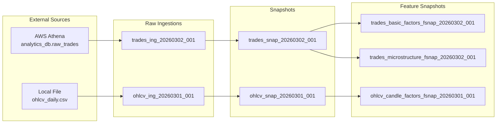

# Athena Data Platform (ADP) — Quant Infrastructure Guide

> **Version**: 1.0
> **Date**: 2026-03-02
> **Status**: Draft
> **Owner**: Tech Lead
> **Audience**: Quant Research, Platform Engineering
> **Related**: [Design Document](./03-design-document.md) · [User Stories](./02-user-stories.md)

---

## Table of Contents

1. [Platform Philosophy](#1-platform-philosophy)
2. [Data Architecture Overview](#2-data-architecture-overview)
3. [Feature Store Architecture](#3-feature-store-architecture)
4. [Factor Pipeline Patterns](#4-factor-pipeline-patterns)
5. [Research Workflow](#5-research-workflow)
6. [Notebook Integration Patterns](#6-notebook-integration-patterns)
7. [Data Lineage Model](#7-data-lineage-model)
8. [Snapshot Management](#8-snapshot-management)
9. [Operational Runbook](#9-operational-runbook)
10. [Change Log](#10-change-log)

---

## 1. Platform Philosophy

### 1.1 What ADP Is

ADP is a **local lakehouse + research factor platform** designed for quantitative research. It combines four subsystems into a unified workflow:

```
┌──────────────────────────────────────────────────────────┐
│                                                          │
│   Local Lakehouse    →  Immutable, versioned data store  │
│        +                                                 │
│   Snapshot Engine    →  Reproducible dataset versions     │
│        +                                                 │
│   Feature Store      →  Deterministic analytical factors  │
│        +                                                 │
│   Research Platform  →  Jupyter + DuckDB + Polars         │
│                                                          │
└──────────────────────────────────────────────────────────┘
```

This resembles a scaled-down internal quant research infrastructure — the kind of tooling found at systematic trading firms — running entirely on a single machine with no cloud dependencies at runtime.

### 1.2 Design Philosophy

| Principle | Quant Research Implication |
|-----------|--------------------------|
| **Immutability** | Research results are always retraceable. No "the data changed" debugging sessions. |
| **Reproducibility** | Re-run any analysis from any point in time. Snapshot + feature definition = deterministic output. |
| **Lazy evaluation** | Work with datasets larger than RAM. Polars only materializes what you query. |
| **Data-as-code** | Datasets and features are version-controlled artifacts. Changes are tracked, reviewable, diffable. |
| **Separation of concerns** | Researchers define *what* features to compute (YAML). Engineers define *how* (strategies). |

### 1.3 What ADP Is NOT

- Not a real-time system (batch only)
- Not a backtesting engine (it produces the *inputs* for backtesting)
- Not a production trading system (research-only)
- Not a distributed system (single machine)

---

## 2. Data Architecture Overview

### 2.1 Data Lifecycle

Data flows through four immutable stages, each stored separately:

```
┌─────────┐     ┌──────────┐     ┌──────────────┐     ┌──────────┐
│  RAW    │────►│  STAGED  │────►│  NORMALIZED  │────►│ FEATURES │
│         │     │          │     │              │     │          │
│ Source  │     │ Cleaned  │     │ Validated    │     │ Factors  │
│ format  │     │ format   │     │ Versioned    │     │ Versioned│
│         │     │          │     │ Snapshotted  │     │          │
└─────────┘     └──────────┘     └──────────────┘     └──────────┘
data/raw/       data/staged/     data/normalized/     data/features/
```

### 2.2 Storage Conventions

| Stage | Format | Mutability | Partitioning | Retention |
|-------|--------|:----------:|:------------:|-----------|
| Raw | Parquet (converted from source) | Immutable | By ingestion ID | Keep all (archivable) |
| Staged | Parquet | Temporary | None | Ephemeral (deleted after normalization) |
| Normalized | Parquet | Immutable | By date (configurable) | Keep all snapshots |
| Features | Parquet | Immutable | By date (configurable) | Keep all versions |

### 2.3 Naming Conventions

```
data/raw/{dataset_name}/{ingestion_id}.parquet
data/normalized/{dataset_name}/{snapshot_id}/part-*.parquet
data/features/{dataset_name}/{feature_set_name}/{feature_snapshot_id}/part-*.parquet
```

**ID Formats:**

| Entity | Format | Example |
|--------|--------|---------|
| Ingestion ID | `{dataset}_ing_{YYYYMMDD}_{seq}` | `trades_ing_20260302_001` |
| Snapshot ID | `{dataset}_snap_{YYYYMMDD}_{seq}` | `trades_snap_20260302_001` |
| Feature Snapshot ID | `{dataset}_{fset}_fsnap_{YYYYMMDD}_{seq}` | `trades_basic_factors_fsnap_20260302_001` |

---

## 3. Feature Store Architecture

### 3.1 Conceptual Model

Features are **deterministic, versioned transformations** derived from normalized dataset snapshots. The relationship is strictly one-directional:

```
Normalized Snapshot
        │
        ▼
Feature Definition  ←── config/features.yaml (versioned)
        │
        ▼
Feature Materialiser  ←── Polars lazy strategies
        │
        ▼
Feature Snapshot  ──── data/features/{dataset}/{fset}/{fsnap_id}/
```

### 3.2 Feature Definition Model

Each feature is defined declaratively in `features.yaml`:

```yaml
trades:
  basic_factors:               # Feature set name
    version: 1                 # Monotonically increasing version
    description: "Core trading factors"
    features:
      - name: rolling_vol_5    # Output column name
        type: rolling_std      # Strategy type (maps to code)
        column: price          # Input column
        window: 5              # Strategy-specific parameter
```

**Key properties:**

- **Feature set** — A named collection of related features (e.g., `basic_factors`, `microstructure`)
- **Version** — Integer version for the feature set definition. Must increment when features change.
- **Definition hash** — SHA-256 of the serialized feature definitions. Automatically computed. Detects silent changes.

### 3.3 Feature Versioning Scheme

Feature versions are tracked at two levels:

**1. Definition version** (human-managed in YAML)

```
features.yaml:
  trades.basic_factors.version: 1  →  2  →  3
```

**2. Definition hash** (machine-computed)

```
SHA-256(serialize(feature_definitions))
  → "a3f8b2c1..."  →  "7d4e9f0a..."  →  "b1c2d3e4..."
```

The materialiser checks both:

| Scenario | Action |
|----------|--------|
| Hash unchanged, version unchanged | Normal rebuild (same definition) |
| Hash changed, version incremented | New version materialised alongside old |
| Hash changed, version NOT incremented | **Warning** — definition changed without version bump |
| Hash unchanged, version incremented | **Warning** — unnecessary version bump |

### 3.4 Feature Storage Layout

```
data/features/
├── trades/
│   ├── basic_factors/
│   │   ├── trades_basic_factors_fsnap_20260301_001/
│   │   │   ├── part-0.parquet
│   │   │   └── _metadata.json
│   │   └── trades_basic_factors_fsnap_20260302_001/
│   │       ├── part-0.parquet
│   │       └── _metadata.json
│   └── microstructure/
│       └── trades_microstructure_fsnap_20260302_001/
│           ├── part-0.parquet
│           └── _metadata.json
└── ohlcv/
    └── candle_factors/
        └── ohlcv_candle_factors_fsnap_20260302_001/
            ├── part-0.parquet
            └── _metadata.json
```

**`_metadata.json` contents:**

```json
{
    "feature_snapshot_id": "trades_basic_factors_fsnap_20260302_001",
    "feature_set": "basic_factors",
    "dataset_name": "trades",
    "dataset_snapshot_id": "trades_snap_20260302_001",
    "feature_version": 1,
    "definition_hash": "a3f8b2c1d4e5f6...",
    "feature_columns": ["rolling_vol_5", "rolling_vol_20", "sma_10", "sma_50", "ewma_12", "simple_returns", "log_returns"],
    "row_count": 12450,
    "created_at": "2026-03-02T14:30:00Z"
}
```

### 3.5 Feature Lineage and Reproducibility Guarantees

Every feature snapshot is linked to exactly one dataset snapshot:

```
feature_snapshot → dataset_snapshot → raw_ingestion(s)
```

**Guarantee:** Given the same `dataset_snapshot_id` and the same `definition_hash`, the materialiser MUST produce a bit-identical Parquet file.

This is enforced by:

1. Polars lazy operations are deterministic (no random, no non-deterministic sorts)
2. Parquet writer settings are fixed (compression: zstd, row group size: 100,000)
3. Feature strategies are pure functions of their inputs

---

## 4. Factor Pipeline Patterns

### 4.1 Supported Feature Types

#### Rolling Statistical Computations

| Type | Formula | Parameters | Quant Use Case |
|------|---------|------------|----------------|
| `rolling_std` | σ over window | `column`, `window` | Rolling volatility |
| `moving_average` | SMA over window | `column`, `window` | Trend following, mean reversion |
| `ewma` | Exponentially weighted MA | `column`, `span` | Smoothed trend signal |
| `rolling_min` | Min over window | `column`, `window` | Support levels, drawdown |
| `rolling_max` | Max over window | `column`, `window` | Resistance levels, high-water mark |

#### Price-Based Computations

| Type | Formula | Parameters | Quant Use Case |
|------|---------|------------|----------------|
| `returns` | (P[t] - P[t-1]) / P[t-1] | `column` | Simple return series |
| `log_returns` | ln(P[t] / P[t-1]) | `column` | Log return series (additive) |
| `vwap` | Σ(price × volume) / Σ(volume) | `price_column`, `volume_column` | Volume-weighted fair value |

### 4.2 Polars Implementation Patterns

Each feature strategy maps to Polars expressions executed lazily. Here are the canonical patterns:

#### Rolling Standard Deviation (Volatility)

```python
class RollingStdStrategy:
    def compute(self, lf: pl.LazyFrame, feature_name: str, params: dict) -> pl.LazyFrame:
        return lf.with_columns(
            pl.col(params["column"])
            .rolling_std(window_size=params["window"])
            .alias(feature_name)
        )
```

**Applied in `features.yaml`:**

```yaml
- name: rolling_vol_5
  type: rolling_std
  column: price
  window: 5
```

**Output:** A column `rolling_vol_5` containing the 5-period rolling standard deviation of `price`. The first 4 rows are `null` (insufficient data for the window).

#### Simple Moving Average

```python
class MovingAverageStrategy:
    def compute(self, lf: pl.LazyFrame, feature_name: str, params: dict) -> pl.LazyFrame:
        return lf.with_columns(
            pl.col(params["column"])
            .rolling_mean(window_size=params["window"])
            .alias(feature_name)
        )
```

#### EWMA (Exponentially Weighted Moving Average)

```python
class EWMAStrategy:
    def compute(self, lf: pl.LazyFrame, feature_name: str, params: dict) -> pl.LazyFrame:
        return lf.with_columns(
            pl.col(params["column"])
            .ewm_mean(span=params["span"])
            .alias(feature_name)
        )
```

#### VWAP (Volume-Weighted Average Price)

```python
class VWAPStrategy:
    def compute(self, lf: pl.LazyFrame, feature_name: str, params: dict) -> pl.LazyFrame:
        price_col = params["price_column"]
        vol_col = params["volume_column"]
        return lf.with_columns(
            (
                (pl.col(price_col) * pl.col(vol_col)).cum_sum()
                / pl.col(vol_col).cum_sum()
            ).alias(feature_name)
        )
```

#### Simple Returns

```python
class ReturnsStrategy:
    def compute(self, lf: pl.LazyFrame, feature_name: str, params: dict) -> pl.LazyFrame:
        col = params["column"]
        return lf.with_columns(
            (pl.col(col).pct_change()).alias(feature_name)
        )
```

#### Log Returns

```python
class LogReturnsStrategy:
    def compute(self, lf: pl.LazyFrame, feature_name: str, params: dict) -> pl.LazyFrame:
        col = params["column"]
        return lf.with_columns(
            (pl.col(col) / pl.col(col).shift(1)).log().alias(feature_name)
        )
```

### 4.3 Composing Multiple Features

The materialiser applies features sequentially to the same LazyFrame, building up columns without collecting:

```python
# Inside FeatureMaterialiser.materialise()
lf = pl.scan_parquet(snapshot_path)

for feature_def in feature_set.features:
    strategy = strategy_registry[feature_def.type]
    lf = strategy.compute(lf, feature_def.name, feature_def.params)

# Single collect at the end
df = lf.collect()
df.write_parquet(output_path)
```

This is efficient because Polars optimizes the full query plan before execution — all features are computed in a single pass over the data.

### 4.4 Future-Ready: Feature-from-Feature Composition

The current design computes features from raw dataset columns. A future extension could support features that depend on other features:

```yaml
# FUTURE — not in initial build
trades:
  derived_signals:
    version: 1
    depends_on: [basic_factors]
    features:
      - name: vol_regime
        type: custom_expression
        expression: "CASE WHEN rolling_vol_20 > 2 * rolling_vol_5 THEN 'high' ELSE 'normal' END"
```

This is out of scope for the initial build but the architecture supports it — feature snapshots are just Parquet files that can be loaded as inputs to subsequent materialisation steps.

---

## 5. Research Workflow

### 5.1 Standard Research Workflow

The typical quant research workflow on ADP follows this pattern:

```
Step 1: Discover          →  What datasets are available?
Step 2: Ingest            →  Pull fresh data from Athena / load file
Step 3: Snapshot          →  Create an immutable normalized version
Step 4: Build Features    →  Materialise analytical factors
Step 5: Explore           →  Load in Jupyter, run SQL, visualize
Step 6: Construct Matrix  →  Build backtest-ready feature matrix
Step 7: Iterate           →  Modify feature definitions, rebuild, compare
```

### 5.2 Detailed Workflow

#### Step 1: Dataset Discovery

```python
from adp import list_datasets, list_snapshots, list_feature_sets

# What datasets exist?
datasets = list_datasets()
print(datasets)
# ┌──────────────┬────────────────────────────────┬──────────────┐
# │ dataset_name │ current_snapshot                │ schema_hash  │
# ├──────────────┼────────────────────────────────┼──────────────┤
# │ trades       │ trades_snap_20260302_001       │ a3f8b2c1...  │
# │ ohlcv        │ ohlcv_snap_20260301_001        │ 7d4e9f0a...  │
# └──────────────┴────────────────────────────────┴──────────────┘

# What snapshots exist for trades?
snapshots = list_snapshots("trades")

# What feature sets are available?
feature_sets = list_feature_sets("trades")
```

Or via CLI:

```bash
adp snapshot list trades
adp features list trades
```

#### Step 2: Ingest Data

```bash
# From Athena
adp ingest trades

# From a local file
adp ingest ohlcv --source file --path /data/external/ohlcv_daily.csv
```

#### Step 3: Create Snapshot

```bash
adp snapshot create trades
# ✓ Snapshot created: trades_snap_20260302_001
#   Rows: 12,450 | Schema: a3f8b2c1... | Path: data/normalized/trades/trades_snap_20260302_001/
```

#### Step 4: Build Features

```bash
adp features build trades basic_factors
# ✓ Built basic_factors from trades_snap_20260302_001
#   Features: rolling_vol_5, rolling_vol_20, sma_10, sma_50, ewma_12, simple_returns, log_returns
#   Rows: 12,450 | Snapshot: trades_basic_factors_fsnap_20260302_001
```

#### Step 5: Explore in Jupyter

```python
from adp import load_dataset, load_features

# Load the latest snapshot
trades = load_dataset("trades").collect()
print(trades.head())

# Load features
factors = load_features("trades", "basic_factors").collect()
print(factors.describe())
```

#### Step 6: Construct Backtest Matrix

```python
from adp import load_features, build_backtest_matrix

# Build a feature matrix with forward returns
matrix = build_backtest_matrix(
    dataset="trades",
    feature_set="basic_factors",
    forward_return_periods=[1, 5, 10],
)

# matrix now has columns:
# [original columns] + [feature columns] + [fwd_return_1, fwd_return_5, fwd_return_10]
```

#### Step 7: Iterate

Modify `features.yaml`, bump the version, and rebuild:

```yaml
# features.yaml — updated
trades:
  basic_factors:
    version: 2        # bumped
    features:
      # ... existing features ...
      - name: sma_200
        type: moving_average
        column: price
        window: 200     # new: 200-period SMA
```

```bash
adp features build trades basic_factors
# ✓ Built basic_factors v2 from trades_snap_20260302_001
# Note: v1 snapshots remain accessible
```

### 5.3 Point-in-Time Correctness

When building backtesting inputs, point-in-time correctness is critical — you must not use information from the future.

**ADP's approach:**

- Features are computed using only data within the snapshot (no look-ahead)
- Rolling computations (`rolling_std`, `moving_average`, etc.) only use past and current values
- Forward returns (in `build_backtest_matrix`) are clearly labeled and computed separately
- Snapshot pinning ensures you use a fixed data version

**Researcher responsibilities:**

- Do not build features on a snapshot that includes data from after the backtest period
- Use snapshot pinning for reproducible backtests: `load_features("trades", "basic_factors@fsnap_id")`
- Validate that the dataset's date range matches the intended research period

---

## 6. Notebook Integration Patterns

### 6.1 Setup Cell

Every research notebook should start with a standard setup pattern:

```python
# Cell 1: Setup
import polars as pl
import duckdb
from adp import (
    load_dataset,
    load_features,
    query_dataset,
    query_features,
    list_datasets,
    list_snapshots,
    list_feature_sets,
)

# Display settings
pl.Config.set_tbl_rows(20)
pl.Config.set_fmt_str_lengths(50)
```

### 6.2 Loading and Inspecting Snapshots

```python
# Cell 2: Load dataset
trades = load_dataset("trades")

# Inspect schema (lazy — no data loaded yet)
print(trades.schema)
# {'trade_id': Utf8, 'symbol': Utf8, 'price': Float64, ...}

# Peek at data (collects only 5 rows)
trades.head(5).collect()
```

### 6.3 Building and Loading Features

```python
# Cell 3: Build features (can also be done via CLI)
import subprocess
subprocess.run(["adp", "features", "build", "trades", "basic_factors"], check=True)

# Cell 4: Load features
factors = load_features("trades", "basic_factors").collect()

# Inspect
print(factors.columns)
# ['trade_id', 'symbol', 'price', 'quantity', 'timestamp', 'side',
#  'rolling_vol_5', 'rolling_vol_20', 'sma_10', 'sma_50', 'ewma_12',
#  'simple_returns', 'log_returns']

factors.describe()
```

### 6.4 DuckDB SQL Queries

```python
# Cell 5: SQL analysis
result = query_features("trades", "basic_factors", """
    SELECT
        symbol,
        COUNT(*) as trade_count,
        AVG(rolling_vol_5) as avg_vol_5,
        AVG(rolling_vol_20) as avg_vol_20,
        AVG(simple_returns) as avg_return
    FROM features
    GROUP BY symbol
    ORDER BY avg_vol_5 DESC
""")
print(result)
```

### 6.5 Visualization Patterns

```python
# Cell 6: Visualize factor signals
import matplotlib.pyplot as plt

btc_factors = factors.filter(pl.col("symbol") == "BTCUSDT").sort("timestamp")

fig, axes = plt.subplots(3, 1, figsize=(14, 10), sharex=True)

# Price with SMA
axes[0].plot(btc_factors["timestamp"], btc_factors["price"], label="Price", alpha=0.7)
axes[0].plot(btc_factors["timestamp"], btc_factors["sma_10"], label="SMA(10)", linewidth=2)
axes[0].plot(btc_factors["timestamp"], btc_factors["sma_50"], label="SMA(50)", linewidth=2)
axes[0].set_ylabel("Price")
axes[0].legend()
axes[0].set_title("BTCUSDT — Price & Moving Averages")

# Rolling volatility
axes[1].plot(btc_factors["timestamp"], btc_factors["rolling_vol_5"], label="Vol(5)")
axes[1].plot(btc_factors["timestamp"], btc_factors["rolling_vol_20"], label="Vol(20)")
axes[1].set_ylabel("Volatility")
axes[1].legend()
axes[1].set_title("Rolling Volatility")

# Returns distribution
axes[2].bar(btc_factors["timestamp"], btc_factors["simple_returns"], alpha=0.6, width=0.8)
axes[2].set_ylabel("Returns")
axes[2].set_title("Simple Returns")

plt.tight_layout()
plt.show()
```

### 6.6 Pinning Snapshots for Reproducibility

```python
# Pin to a specific snapshot for reproducible research
trades_v1 = load_dataset("trades", snapshot_id="trades_snap_20260301_001")
factors_v1 = load_features("trades", "basic_factors@trades_basic_factors_fsnap_20260301_001")

# This ensures your notebook produces the same results every time,
# regardless of newer data or feature versions.
```

---

## 7. Data Lineage Model

### 7.1 Full Lineage Chain

Every feature value can be traced back to its raw source through a chain of metadata records:

```
Feature Value
    │
    ▼
Feature Snapshot        (feature_snapshots table)
    │   feature_snapshot_id = "trades_basic_factors_fsnap_20260302_001"
    │   feature_version = 1
    │   definition_hash = "a3f8b2c1..."
    │
    ▼
Dataset Snapshot        (snapshots table, via feature_lineage)
    │   snapshot_id = "trades_snap_20260302_001"
    │   schema_hash = "7d4e9f0a..."
    │   normalization_version = "1.0"
    │
    ▼
Raw Ingestion(s)        (raw_ingestions table, via snapshot_lineage)
    │   ingestion_id = "trades_ing_20260302_001"
    │   source_type = "athena"
    │   source_location = "SELECT ... FROM raw_trades WHERE ..."
    │
    ▼
External Source
    │   AWS Athena → analytics_db.raw_trades
```

### 7.2 Lineage Query Examples

#### "What raw data feeds this feature snapshot?"

```sql
-- Given a feature snapshot, trace back to raw ingestions
SELECT ri.*
FROM feature_lineage fl
JOIN snapshot_lineage sl ON fl.dataset_snapshot_id = sl.snapshot_id
JOIN raw_ingestions ri ON sl.ingestion_id = ri.ingestion_id
WHERE fl.feature_snapshot_id = 'trades_basic_factors_fsnap_20260302_001';
```

#### "What snapshots were built from this ingestion?"

```sql
SELECT s.*
FROM snapshot_lineage sl
JOIN snapshots s ON sl.snapshot_id = s.snapshot_id
WHERE sl.ingestion_id = 'trades_ing_20260302_001';
```

#### "What features depend on this snapshot?"

```sql
SELECT fs.*
FROM feature_lineage fl
JOIN feature_snapshots fs ON fl.feature_snapshot_id = fs.feature_snapshot_id
WHERE fl.dataset_snapshot_id = 'trades_snap_20260302_001';
```

#### "Full lineage for a feature set"

```sql
SELECT
    fs.feature_snapshot_id,
    fs.feature_name,
    fs.feature_version,
    s.snapshot_id AS dataset_snapshot,
    s.schema_hash,
    ri.ingestion_id,
    ri.source_type,
    ri.source_location,
    ri.ingestion_timestamp
FROM feature_snapshots fs
JOIN feature_lineage fl ON fs.feature_snapshot_id = fl.feature_snapshot_id
JOIN snapshots s ON fl.dataset_snapshot_id = s.snapshot_id
JOIN snapshot_lineage sl ON s.snapshot_id = sl.snapshot_id
JOIN raw_ingestions ri ON sl.ingestion_id = ri.ingestion_id
WHERE fs.feature_name = 'basic_factors'
ORDER BY fs.created_at DESC;
```

### 7.3 Lineage Diagram (Mermaid)



---

## 8. Snapshot Management

### 8.1 Retention Policies

Because ADP stores immutable data, storage grows monotonically. A retention policy prevents unbounded growth.

**Recommended policy tiers:**

| Tier | Scope | Retention | Rationale |
|------|-------|-----------|-----------|
| **Active** | Last 5 snapshots per dataset | Keep on disk | Active research use |
| **Archive** | Snapshots 6–20 | Compress to `.tar.zst` | Accessible but space-efficient |
| **Purge** | Snapshots >20 | Delete (after confirmation) | Free disk space |

**Implementation (future CLI command):**

```bash
# Show storage usage per dataset
adp storage usage

# Archive old snapshots
adp storage archive trades --keep-last 5

# Purge archived snapshots older than 90 days
adp storage purge --older-than 90d
```

### 8.2 Storage Growth Estimation

| Dataset Size | Snapshots/Day | Features/Snapshot | Daily Growth | Monthly Growth |
|:----------:|:-------------:|:-----------------:|:----------:|:------------:|
| 100K rows | 1 | 2 feature sets | ~50 MB | ~1.5 GB |
| 1M rows | 1 | 2 feature sets | ~500 MB | ~15 GB |
| 10M rows | 1 | 2 feature sets | ~5 GB | ~150 GB |

**Mitigation strategies:**

- Parquet compression (zstd) typically achieves 3–5x compression on financial data
- Partition by date to enable selective reads (only load needed partitions)
- Archive policy for old snapshots (compress to tarball)
- Raw data can be re-ingested from Athena — only keep the latest raw

### 8.3 Storage Directory Management

```
data/
├── raw/              ← Can be pruned after snapshot creation
│   └── trades/
│       ├── trades_ing_20260301_001.parquet  (archivable)
│       └── trades_ing_20260302_001.parquet  (active)
├── normalized/       ← Primary storage, retention policy applies
│   └── trades/
│       ├── trades_snap_20260301_001/        (archivable)
│       └── trades_snap_20260302_001/        (active)
└── features/         ← Secondary storage, retention policy applies
    └── trades/
        └── basic_factors/
            ├── trades_basic_factors_fsnap_20260301_001/  (archivable)
            └── trades_basic_factors_fsnap_20260302_001/  (active)
```

---

## 9. Operational Runbook

### 9.1 Common CLI Workflows

#### First-Time Setup

```bash
# 1. Initialize the platform
adp init

# 2. Edit config/datasets.yaml with your dataset definitions
# 3. Edit config/features.yaml with your feature definitions

# 4. Ingest initial data
adp ingest trades

# 5. Create first snapshot
adp snapshot create trades

# 6. Build features
adp features build trades basic_factors

# 7. Start Jupyter and begin research
jupyter lab
```

#### Daily Data Refresh

```bash
# Ingest new data
adp ingest trades

# Create new snapshot (old snapshots preserved)
adp snapshot create trades

# Rebuild features from the new snapshot
adp features build trades basic_factors
adp features build trades microstructure
```

#### Exploring Data History

```bash
# List all snapshots for a dataset
adp snapshot list trades

# Show details of a specific snapshot
adp snapshot show trades_snap_20260302_001 --lineage

# List all feature sets
adp features list trades

# Show feature set history
adp features show trades basic_factors --history
```

### 9.2 Troubleshooting Guide

#### Problem: `SchemaValidationError` during normalization

```
SchemaValidationError: Column 'price' expected type float, got str
```

**Cause:** The raw data has a column type mismatch with the schema in `datasets.yaml`.

**Resolution:**

1. Check if the source data schema changed (Athena table altered?)
2. If the schema change is valid, update `datasets.yaml` and bump `normalization_version`
3. If the data is corrupted, re-ingest from source with `--force`

---

#### Problem: Feature definition hash mismatch warning

```
Warning: Feature definition hash changed but version not incremented for basic_factors
```

**Cause:** You modified `features.yaml` without bumping the `version` field.

**Resolution:**

1. If the change is intentional, increment `version` in `features.yaml`
2. If the change is accidental, revert `features.yaml` to the previous state
3. Rebuild: `adp features build trades basic_factors`

---

#### Problem: `DatasetNotFoundError`

```
DatasetNotFoundError: Dataset 'my_dataset' is not registered
```

**Cause:** The dataset hasn't been ingested yet, or the name doesn't match `datasets.yaml`.

**Resolution:**

1. Check `adp snapshot list my_dataset` — does it exist?
2. Verify the name in `config/datasets.yaml`
3. Run `adp ingest my_dataset` to create the dataset

---

#### Problem: Out of memory during normalization

```
MemoryError: ...
```

**Cause:** Data is too large for eager evaluation, or a `.collect()` is being called too early.

**Resolution:**

1. Verify that the normalization pipeline uses Polars lazy frames throughout
2. Check for accidental `.collect()` calls in custom processing steps
3. Consider partitioning the dataset into smaller date ranges
4. Increase system swap space as a temporary measure

---

#### Problem: DuckDB cannot read Parquet file

```
duckdb.IOException: Could not read parquet file: ...
```

**Cause:** Parquet file may be corrupted, or the schema is incompatible.

**Resolution:**

1. Verify the file is readable by Polars: `pl.scan_parquet(path).head(5).collect()`
2. If Polars can read it but DuckDB can't, the issue is a Parquet version mismatch
3. Re-create the snapshot (the source data is preserved in `data/raw/`)

### 9.3 Performance Tuning

#### Lazy Evaluation Best Practices

```python
# GOOD: Lazy pipeline — Polars optimizes the full plan
lf = (
    pl.scan_parquet("data/normalized/trades/trades_snap_20260302_001/")
    .filter(pl.col("symbol") == "BTCUSDT")
    .select("price", "quantity", "timestamp")
)
result = lf.collect()  # Single materialization

# BAD: Eager collection too early — loads all data into memory
df = pl.read_parquet("data/normalized/trades/trades_snap_20260302_001/")  # Loads everything
df = df.filter(pl.col("symbol") == "BTCUSDT")  # Filters after loading
df = df.select("price", "quantity", "timestamp")  # Selects after loading
```

#### Partition Strategies

| Data Pattern | Recommended Partition | Benefit |
|-------------|----------------------|---------|
| Time-series (daily) | Partition by `date` | DuckDB/Polars prune partitions for date range queries |
| Multi-symbol time-series | Partition by `date` | Balances partition size with query flexibility |
| Small datasets (<100K rows) | No partitioning | Overhead of partitions exceeds benefit |

#### DuckDB Query Optimization

```python
# GOOD: Let DuckDB push down predicates to Parquet
result = query_dataset("trades", """
    SELECT date, AVG(price) as avg_price
    FROM dataset
    WHERE symbol = 'BTCUSDT'      -- Pushed down to Parquet
      AND date >= '2026-01-01'    -- Partition pruning
    GROUP BY date
""")

# LESS OPTIMAL: Loading all data then filtering in Python
all_data = load_dataset("trades").collect()
btc = all_data.filter(pl.col("symbol") == "BTCUSDT")
```

---

## 10. Change Log

| Date | Version | Author | Change |
|------|---------|--------|--------|
| 2026-03-02 | 1.0 | — | Initial quant infrastructure guide |

---

*Cross-references: [Project Delivery Plan](./01-project-delivery-plan.md) · [User Stories](./02-user-stories.md) · [Design Document](./03-design-document.md) · [Test Strategy](./04-test-strategy.md)*
